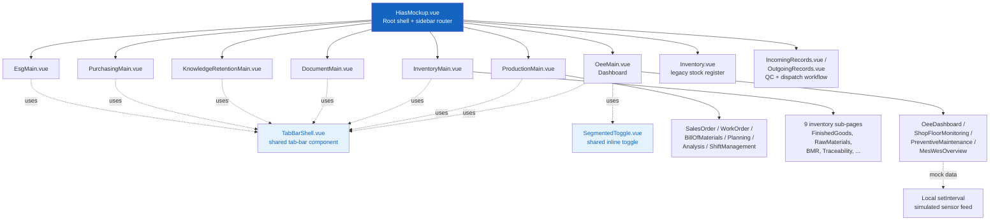

# Concept HIAS — MES Module UI/UX Concept

A standalone front-end concept for a halal food-manufacturing **Manufacturing Execution System (MES)** — the floor-level system that sits between high-level ERP/planning and the actual production line: work orders, QC inspection, inventory, OEE/shop-floor monitoring, and compliance tracking.

This is a UI/UX concept and portfolio piece, not a production system — there is no real backend. All data is mocked, and the "live" dashboards run on local simulated data feeds rather than a real broker connection.

**Live demo:** https://shyishengtan009-cmd.github.io/MES_Concept/

---

## What's in it

| Section | Covers |
|---|---|
| **Dashboard** | OEE tracking, shop floor monitoring, preventive maintenance, combined MES/WES overview |
| **Document** | Compliance documents, monitoring logs, pest control, machine maintenance |
| **Production** | Sales orders, work orders, bill of materials, production planning, production analysis, shift management |
| **Inventory** | Finished/semi-finished goods, raw materials, trading products, labelling, packaging, batch manufacturing records (BMR), sample retention, traceability |
| **Knowledge Retention** | Recipe management, SOPs, food cost calculation, cost analysis (budget vs. actual) |
| **Purchasing** | Supplier management, raw material purchasing |
| **ESG** | Energy/water monitoring, waste/emission tracking, worker safety compliance, ESG reporting |

Plus a legacy **Incoming/Outgoing Records** module with a full QC inspection and dispatch-check workflow — condition checks, halal-label verification, cold-chain temperature compliance, pass/fail/correction flows, and a shared stock-pool model.

## Notable implementation details

- **Shared component architecture** — a `TabBarShell.vue` component (scrollable section-navigation tab bar) and `SegmentedToggle.vue` component (small inline view-toggle) are reused across every MES section, instead of each page carrying its own copy of the same template/CSS. Fixing a tab-bar bug means touching one file, not fifteen.
- **Simulated live data** — dashboards that look "live" (OEE gauges, shop floor sensor readouts) run on local `setInterval`-driven mock generators rather than a real MQTT broker connection, so the demo has no external dependency and nothing to keep paying for or securing.
- **Excel export** — register pages (Incoming/Outgoing Records, Cost Analysis, etc.) export real styled `.xlsx` files via ExcelJS, not just CSV dumps.
- **Period-aware reporting** — Cost Analysis genuinely recomputes all KPIs, cost breakdown, and budget-vs-actual data when switching between MTD/This Month/Q1/YTD, rather than just relabeling a static view.

## Tech stack

- Vue 3 (`<script setup>`, Composition API) + TypeScript
- Vite 5
- ExcelJS (styled spreadsheet export)
- Plain CSS (scoped, no UI framework) — design system built from scratch: KPI cards, filter bars, slide-in detail panels, data tables

## Architecture



## Project structure

```
Concept_HIAS/
├── HiasMockup.vue              # Root shell — sidebar, routing, page mounting
├── TabBarShell.vue             # Shared scrollable tab-bar (used by all 7 MES sections)
├── SegmentedToggle.vue         # Shared small inline view-toggle
├── *Main.vue                   # One per MES section (tab container + page imports)
├── Inv*.vue, Doc*.vue,         # Individual page components, grouped by section prefix
│   Kr*.vue, Esg*.vue, Pur*.vue
├── IncomingRecords.vue /       # Legacy stock-register module + QC/dispatch workflow
│   OutgoingRecords.vue /
│   Inventory.vue
├── src/
│   ├── main.ts                 # App entry point
│   ├── mqttService.ts          # Mock live-data status stub (see note above)
│   └── inventoryCatalog.ts     # Shared finished-goods product/batch data
├── Controllers/                # C# reference controllers (not wired to a running API)
└── public/                     # Static assets
```

## Running locally

```bash
npm install
npm run dev
# http://localhost:5173
```

```bash
npm run build      # outputs to dist/
```

Deploys automatically to GitHub Pages on every push to `main` via `.github/workflows/deploy.yml`.
